# Machine Learning and Analytics
## Homework Project 2
## Test log

### Test 1: Provided code

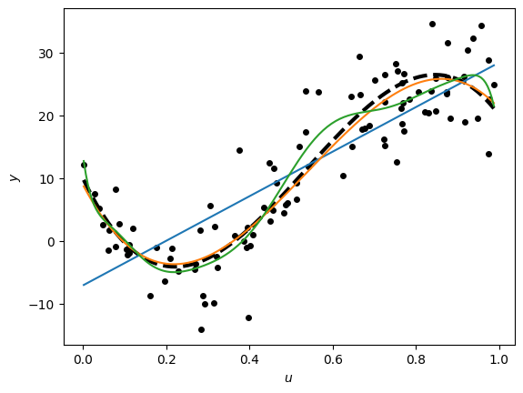

When testing the code with the provided values, the linear model (p=1) is underfitting because it is not complex enough to capture the trend of the data. The polynomial p=3 provides an ideal fit, accurately following the targets dashed line. The polynomial p=15 is overfitting, because it is too complex and it is learning the noise instead of the trend. While it has the lowest training loss, it isn't performing that well on the test data.

### Test 2: Changing the order of the polynomial of the data generation

#### 2.1. p = 1, beta = np.array([[10, -140]]).T
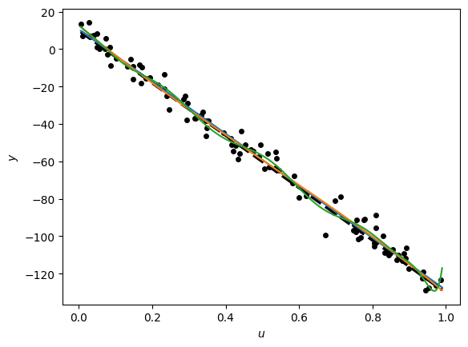

#### 2.2. p = 2, beta = np.array([[10, -140, 400]]).T
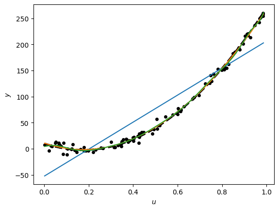

#### 2.3. p = 5, beta = np.array([[10, -140, 400, -250, 20, -50]]).T
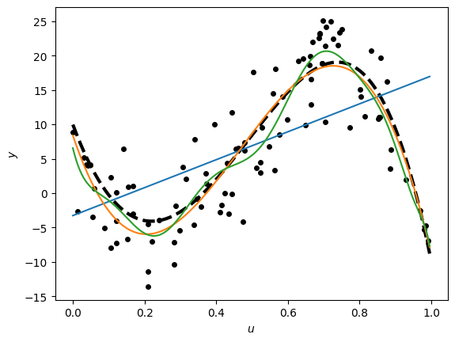

#### 2.4. p = 8, beta = np.array([[10, -140, 400, -250, 20, -50, 200, -40, 100]]).T
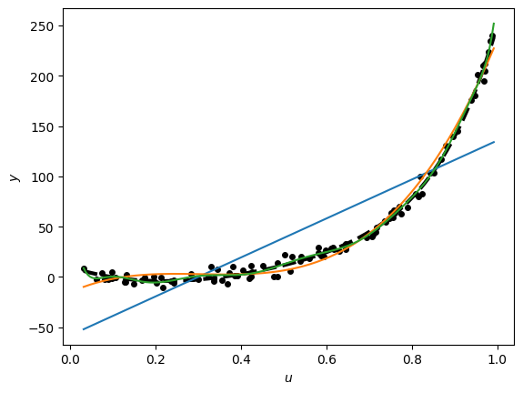

#### 2.5. p = 10, beta = np.array([[10, -140, 400, -250, 20, -50, 200, -40, 100, -5, 300]]).T
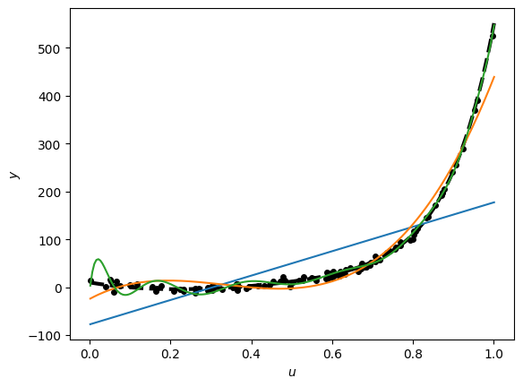

#### 2.6. p = 15, beta = beta = np.array([[10, -140, 400, -250, 20, -50, 200, -40, 100, -5, 300, -80, 75, -20, 150, -10]]).T
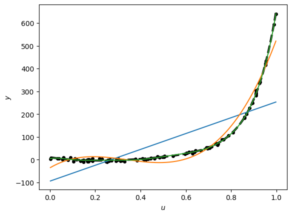

#### 2.7. p = 20, beta = np.array([[10, -140, 400, -250, 20, -50, 200, -40, 100, -5, 300, -80, 75, -20, 150, -10, 50, -30, 40, -220, 160]]).T
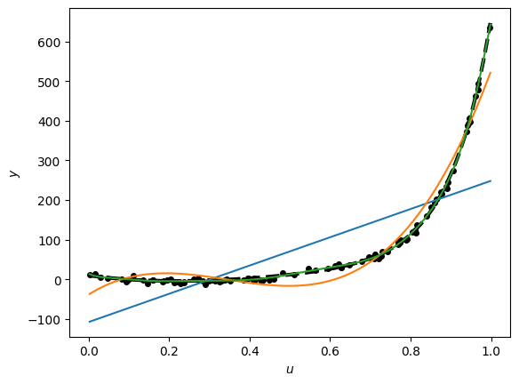

Varying the generation order changes the performance of the models. By increasing the generation polynomial order, the data become more complex, and less complex models start underfitting, while more complex problems start performing better. By lowering the generation polynomial order to p=1, all the models with larger order could start to overfit and less complex models perform better. For each different order p in generation, the model with order p' = p is the ideal model, and in general, the models with p' nearest to p have less loss.

### Test 3: Testing different spreads of σ 

#### 3.1. σ = 0, p = 3

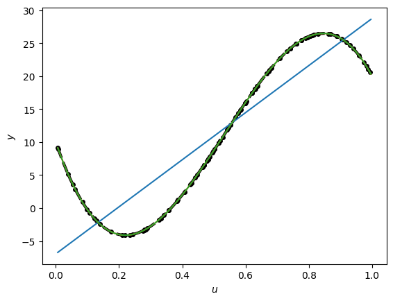

### 3.2 σ = 0, p = 20

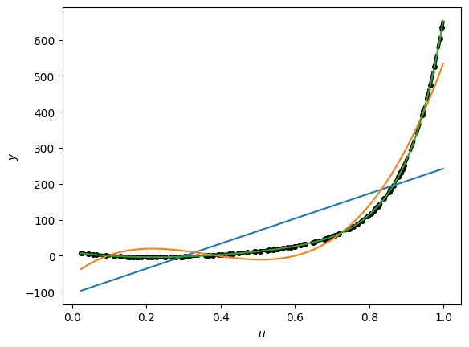

### 3.3 σ = 0, p = 10
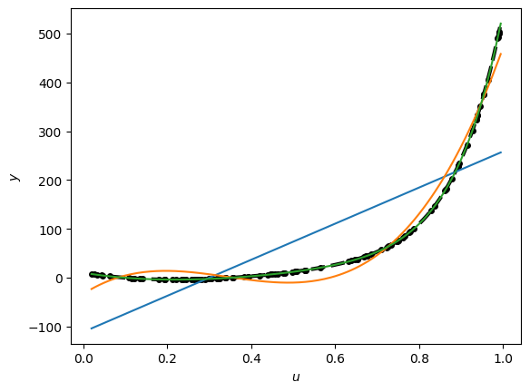

### 3.4 σ = 0, p = 30
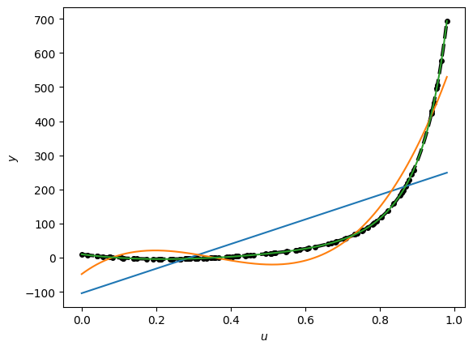

For σ=0, the models with order greater or equal than the generation order perform perfectly, while the models with smaller generation order underfit. What surprises me is that p=15 keeps performing flawlessly for the generations with bigger p.

### 3.5 σ = 1, p = 3
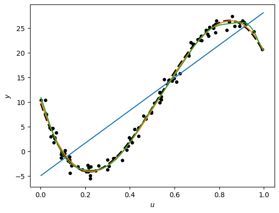

### 3.6 σ = 2, p = 3
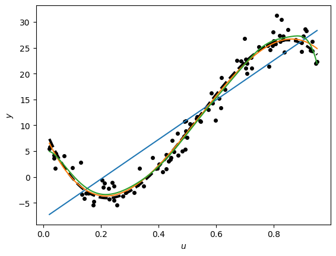

### 3.7 σ = 10, p = 3
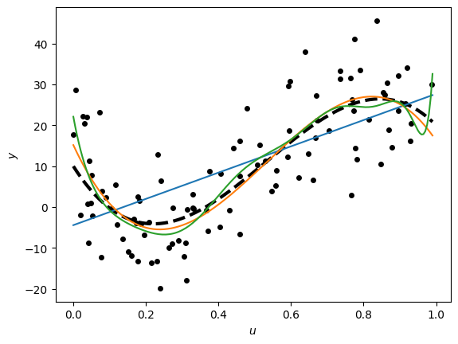

### 3.8 σ = 50, p = 3
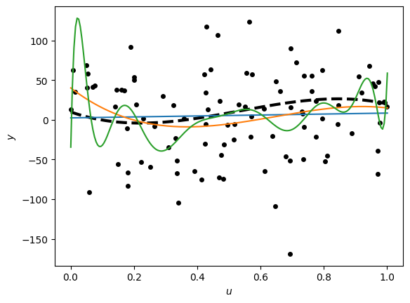

### 3.9 σ = 100, p = 3

I observe that with lower σ, the data points follow their curve much more, and the models learn much better the trends without the random noise. The bigger the σ, the data points deviate much more from the curve and the models have much more difficulty following the trend. Particularly, the model with order p=15 learns much more noise and the overfitting is much more obvious with larger σ.

### Test 4: Different numbers of data points

### 4.1 n = 2
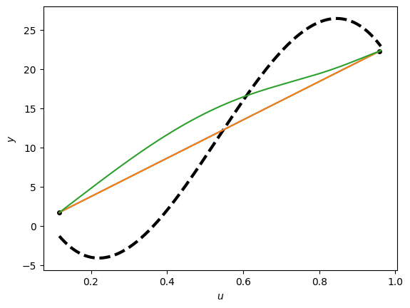

### 4.2 n = 10
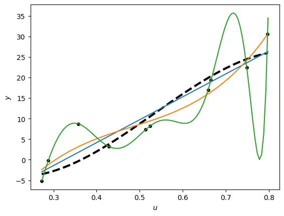

### 4.3 n = 20
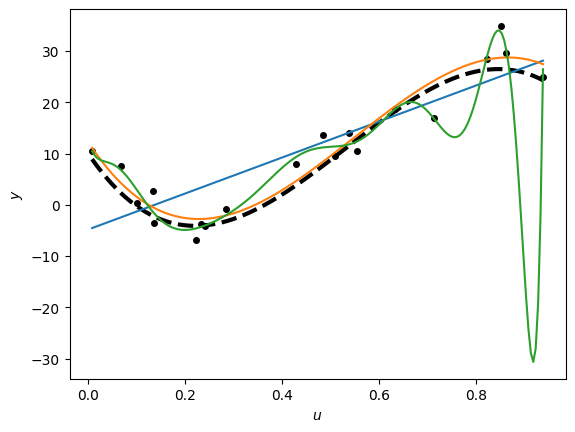

### 4.4 n = 50
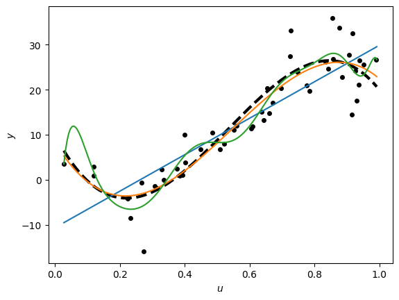

### 4.5 n = 500
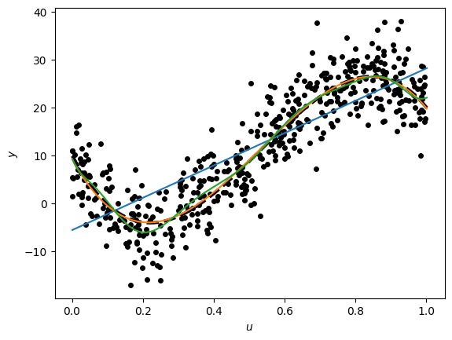

### 4.6 n = 5000
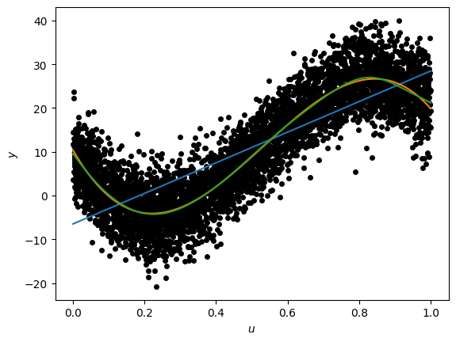

### 4.7 n = 10000
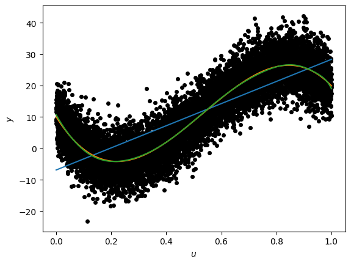

### 4.8 n = 1000000
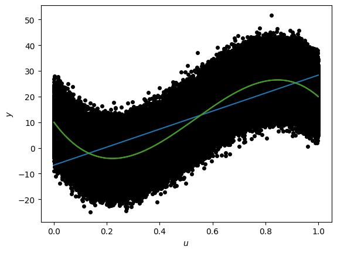

I observe that with very few data, all models fail to learn anything at all, and the overfitting of model p=15 is very obvious.
The models' performance increases as the data increase, and model p=15 stops overfitting when it is trained with many data.

### Test 5: Different distributions of feature values

### 5.1 Added +0.5 in test set data points
| 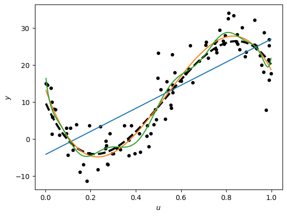 | 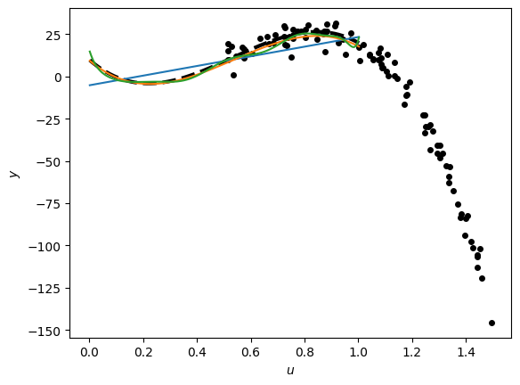 |
| :---: | :---: |
| **Training Set** | **Test Set** |

### 5.2 Added +1 in test set data points
| 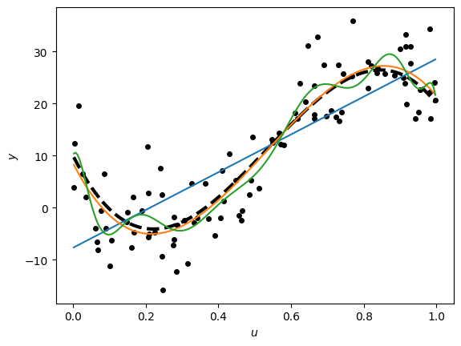 | 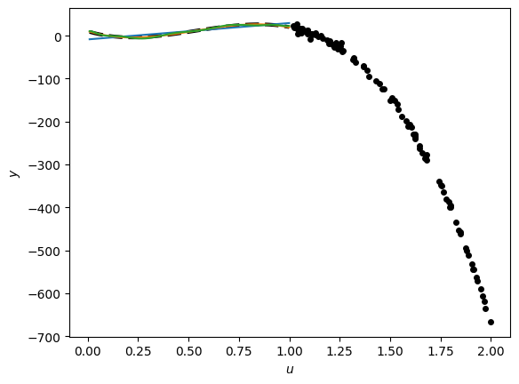 |
| :---: | :---: |
| **Training Set** | **Test Set** |

### 5.3 Added +100 in test set data points
| 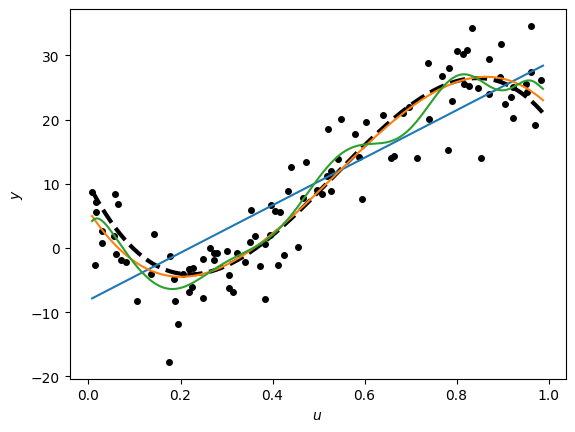 | 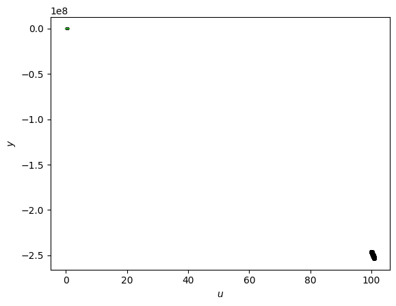 |
| :---: | :---: |
| **Training Set** | **Test Set** |

### 5.4 Added -10 in test set data points
| 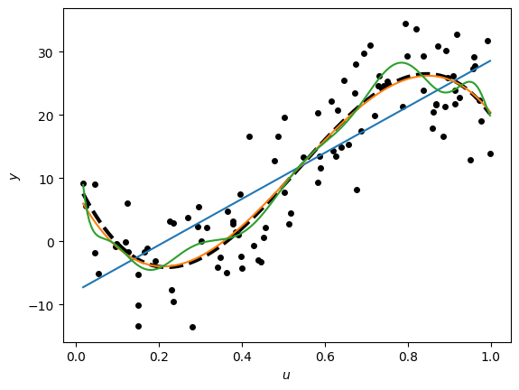 | 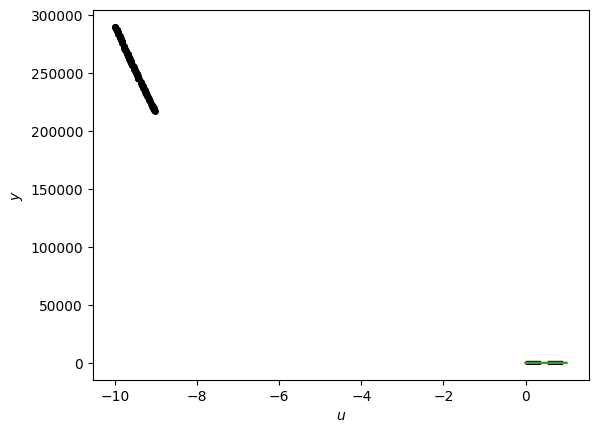 |
| :---: | :---: |
| **Training Set** | **Test Set** |

I observe that the more I deviate from the training set interval, the worse the performance of the models becomes in the test set. All models are failing to generalize to the different tests. They keep following the trend correctly for the training set, but for the test set, the curves are completely shifted and wrong. The biggest the deviation of the test set interval, the worse the performance for all models.

### Test 6: Test and training set skewed

### 6.1 Using radn for both sets with mean=0.5 and std=0.1
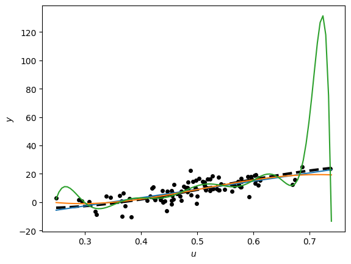

### 6.2 Using radn for both sets with mean=0.1 and std=0.005
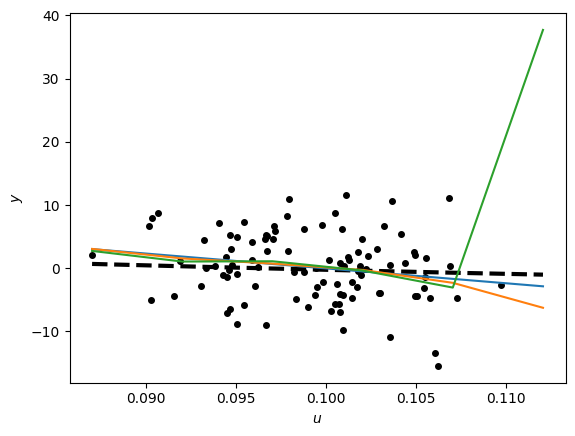

I notice that with the skewed datasets, all models (and especially order p=15), perform well where there are a lot of values, but deviate from the trend on the edges of the values where there are less samples. With the test set being skewed in the same way, the loss does not deteriotate.

### Test 7: One dataset skewed and one even

### 7.1 Skewed training set, even test set
|  | 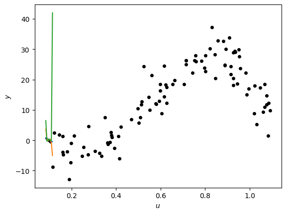 |
| :---: | :---: |
| **Training Set** | **Test Set** |

In this case, the training curve is as above, and the model is clearly overfitting, since the test set curves are all completely wrong. The models fail to learn the trends in the edges where there are a few training samples.

### 7.2 Even training set, skewed test set
| 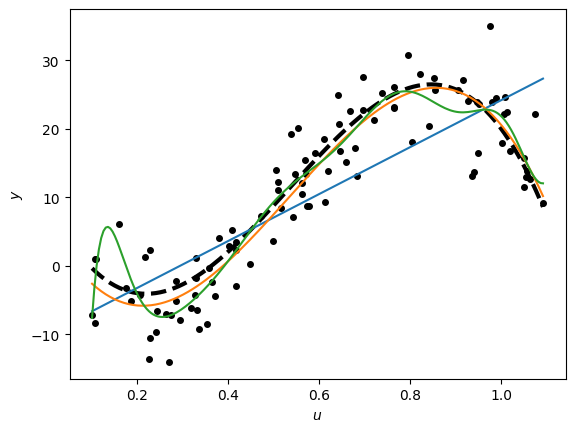 | 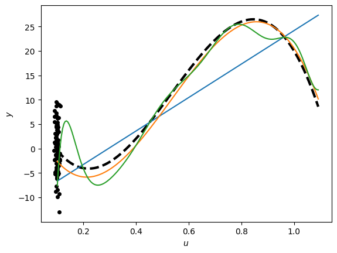 |
| :---: | :---: |
| **Training Set** | **Test Set** |

In this set-up, the model learn well the curve as in the original set-ups. The models have captured successfully the trend from training, and they perform well on the skewed test set (especially for the ideal model of order p=3).

### Test 8: Cross-Validation

### Test 8: Cross-Validation Detailed Matrix

### Test 8: Full Cross-Validation Matrix

#### 8.1 n = 10

| K (Folds) | p=1 loss | p=3 loss | p=15 loss |
| :--- | :---: | :---: | :---: |
| 2 | 4.9189 | 3207.4760 | 37352993.6104 |
| 5 | 5.4451 | 19.8902 | 2631239406.8230 |
| 7 | 8.0064 | 59.9785 | 2639883331.2523 |
| 10 | 6.1295 | 14.1787 | 107289165498.4585 |

For this very small dataset, it seems that cross validation affects a lot the results, with the losses varying a lot between the different folds. However, data are too few and the models are not performing well, with the best being model p=1. Smaller K values appear slightly more stable for the higher-order models.

#### 8.2 n = 20

| K (Folds) | p=1 loss | p=3 loss | p=15 loss |
| :--- | :---: | :---: | :---: |
| 2 | 2.9081 | 9.1645 | 3152155.0451 |
| 5 | 3.0036 | 3.9397 | 291908.0034 |
| 10 | 3.1334 | 4.0143 | 2270110.1217 |
| 15 | 5.7117 | 6.8322 | 4733135.7755 |
| 20 | 3.3745 | 4.1137 | 137008.2332 |

With 20 data points, the errors begin to decrease, but p=1 remains the most performant model. For K>=15 the error rises, as the training samples are too few.

#### 8.3 n = 50

| K (Folds) | p=1 loss | p=3 loss | p=15 loss |
| :--- | :---: | :---: | :---: |
| 2 | 1.0852 | 0.6447 | 1818.2736 |
| 50 | 5 | 1.0574 | 0.5078 | 105.3696 |
| 50 | 10 | 1.0750 | 0.5126 | 2.7865 |
| 50 | 20 | 1.2048 | 0.5645 | 1.3015 |
| 50 | 25 | 1.0860 | 0.5062 | 1.7707 |
| 50 | 35 | 1.4501 | 0.6829 | 2.1646 |
| 50 | 40 | 1.7247 | 0.8061 | 2.3394 |
| 50 | 50 | 1.0867 | 0.5054 | 1.2403 |

For n=50, all models start performing significantly better, with p=3 being the better one. Higher K seems to result in lower losses. 

#### 8.4 n = 100

| K (Folds) | p=1 loss | p=3 loss | p=15 loss |
| :--- | :---: | :---: | :---: |
| 2 | 0.5238 | 0.2890 | 0.3259 |
| 5 | 0.5250 | 0.2825 | 0.3083 |
| 10 | 0.5283 | 0.2854 | 0.3917 |
| 15 | 0.5873 | 0.2995 | 4.0520 |
| 25 | 0.5325 | 0.2939 | 0.3907 |
| 75 | 0.8556 | 0.4326 | 0.4693 |
| 100 | 0.5377 | 0.2952 | 0.3088 |

The results for n=100 much better, with p=3 outperforming the other models. K=5 provides the lowest loss for all models, while Large K values show an increase in error.

#### 8.5 n = 10000

| K (Folds) | p=1 loss | p=3 loss | p=15 loss |
| :--- | :---: | :---: | :---: |
| 10 | 0.0052 | 0.0025 | 0.0025 |
| 100 | 0.0052 | 0.0025 | 0.0025 |
| 500 | 0.0052 | 0.0025 | 0.0025 |
| 1000 | 0.0052 | 0.0025 | 0.0025 |
| 10000 | 0.0052 | 0.0025 | 0.0025 |

With a very large dataset, the cross validation does not impact the result. All models have the same error regardless of how many folds are used.

**Conclusion:**

Choosing the best K depends on the sample size n. When n is small, smaller K values have better results. As n grows, the best value for K varies. In huge datasets, cross validation does not affect the loss of the models.