# Machine Learning and Analytics
## Homework Project 3
## Test log

### 1. Understand and comment

Comments provided on code

### 2. Testing provided code

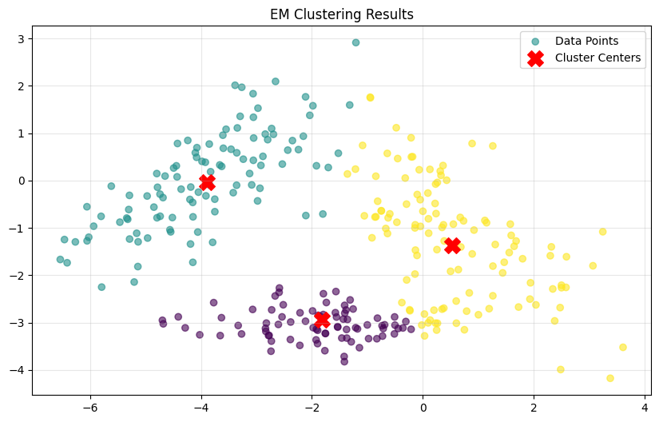

The EM algorithm effectively identifies the three clusters within the dataset, as shown by the centers converging on the densest regions of data. The normal_pdf function utilizes a fixed variance of 1.0, which results in the algorithm creating clear, linear partitions between the clusters.

### 3. Dataset split test

| 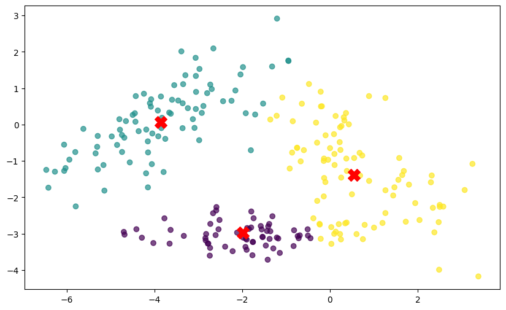 | 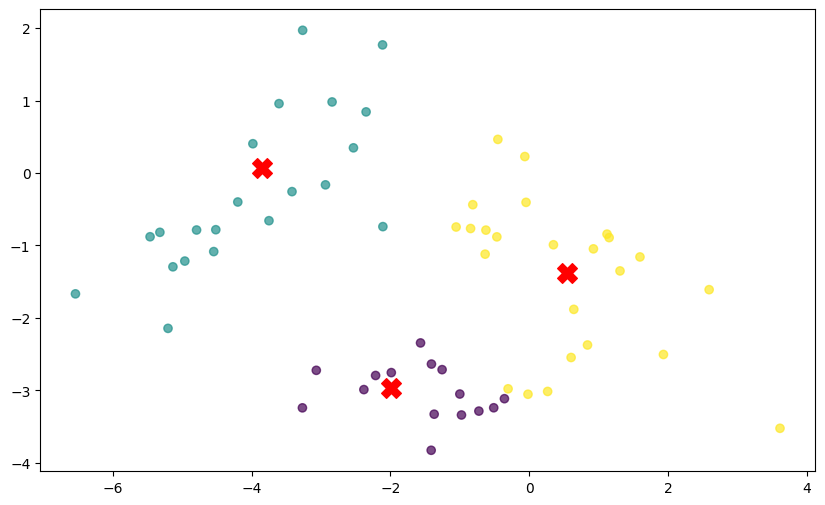 |
| :---: | :---: |
| **Training Set** | **Test Set** |

The EM algorithm clusters the test points adequately, demonstrating that the parameters learned during the training phase generalize well to unseen data. Because the data was split randomly, the test set maintains a spatial distribution consistent with the training set, allowing the cluster centers to remain accurately positioned within the dense regions of the test groups. The fixed-variance continues to produce clear, linear partitions between the clusters, and the consistent color assignments across both plots confirm that the model successfully captured the underlying structure of the dataset.

### 4. Symmetric Gaussians with a fixed variance of 1

1. Are symmetric Gaussians with a fixed variance of 1.0 a reasonable assumption?

Symmetric Gaussians with a fixed variance of 1.0 is a reasonable assumption for this dataset because the data points form circular, similarly-sized groups that align with the fixed variance of 1.0. However, I am not sure this is the case since the purple dataset presents less spread than the other two.

2. What happens as you experiment with different variances?

Changing the fixed variance alters the clusters. A large variance results in the model grouping all data points to the same cluster. Setting a small variance (e.g. 0.01), follows the same behaviour as the test I previously run.

| 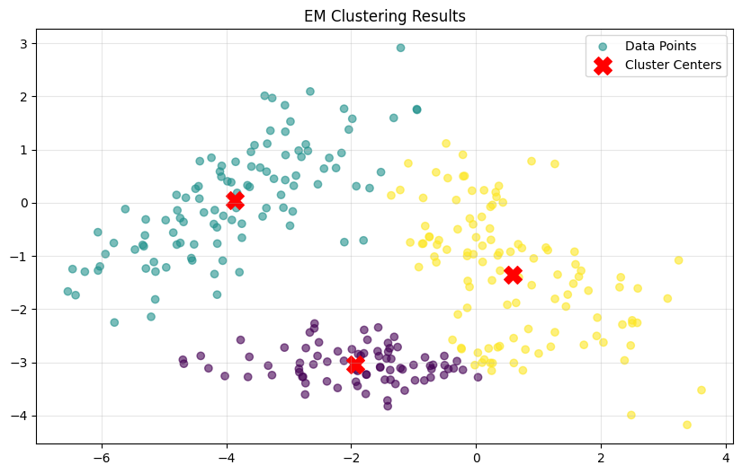 |  |
| :---: | :---: |
| **Variance 0.1** | **Variance 5.0** |

3. What happens if you change the starting values for the weights and/or means?

Changing the starting means demonstrates that EM is sensitive to means initialization. If the initial means are placed too far from the data, the algorithm fails to find the three distinct groups. However, the model seems robust to starting weights, as different weights do not affect the performance of the algorithm.

| 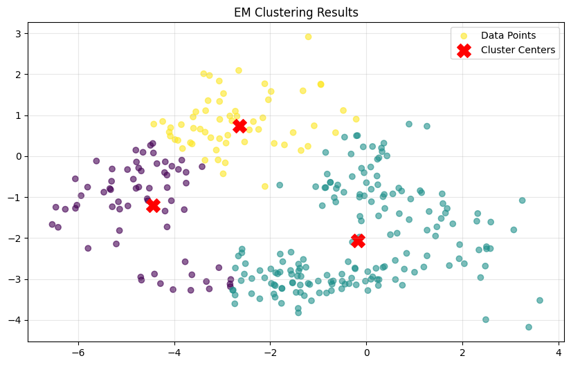 | 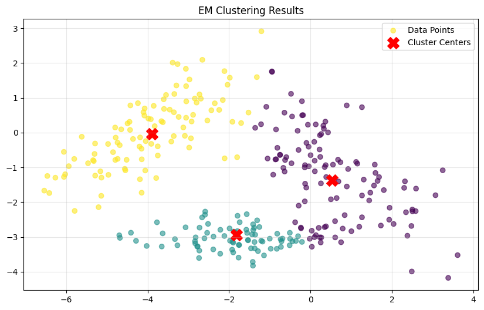 |  |
| :---: | :---: | :---: |
| **Different range of values for means** | **Means in one cluster** | **Different unbalanced weights** |

4. What happens if you vary the number of iterations?

Varying the iterations shows that the algorithm starts performing quite well from the beginning, reaching convergence after only 10 iterations.

| 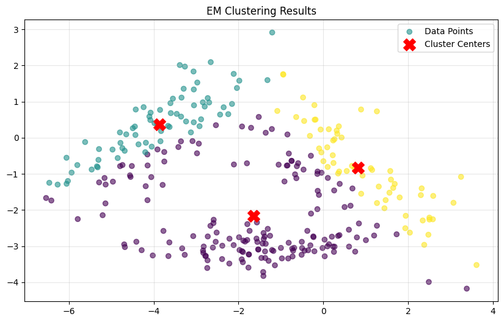 | 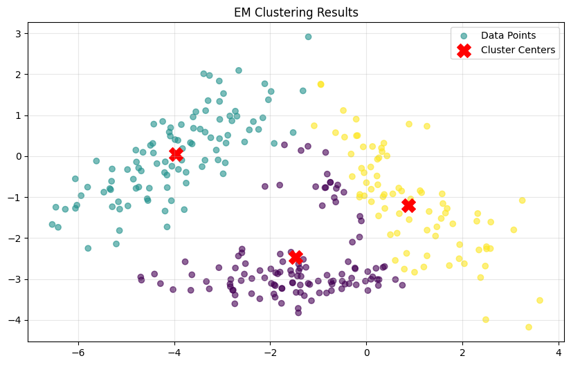 |  |  |
| :---: | :---: | :---: | :---: |
| **1 Iteration** | **2 Iterations** | **10 Iterations** | **1000 Iterations** |

5. What happens if you change the number of clusters (K)?

Changing the number of clusters forces the model to either underfit or overfit. Setting K=2 forces the algorithm to merge two groups into one, while setting K>3 causes it to split a single cluster into sub-clusters, even though there is no gap in their data points to justify different centers.

| 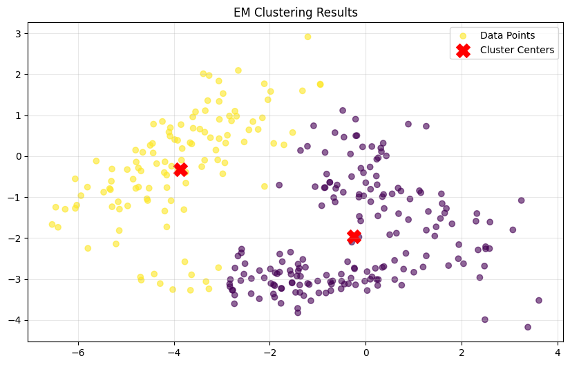 | 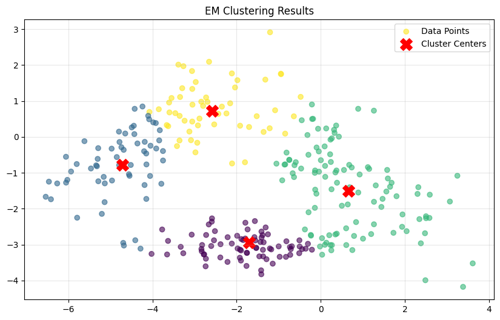 |
| :---: | :---: |
| **K=2** | **K=4** |

### 5. K-means algorithm

1. How does K-means compare to the Gaussian means algorithm? 

K-means is a hard clustering algorithm, whereas the Gaussian EM algorithm is soft. EM calculates the probability of a point belonging to every cluster, while K-means assignes each point strictly to the single nearest centroid based on Euclidean distance.

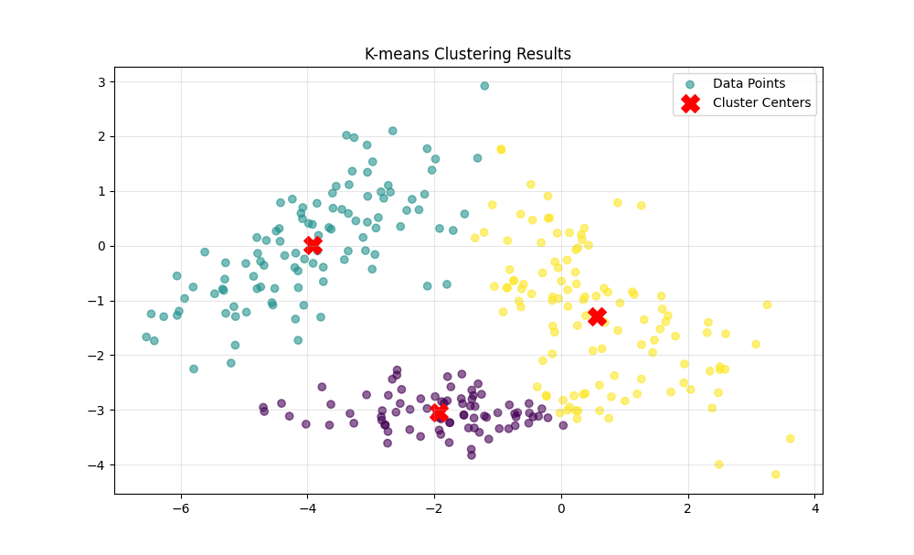

2. How sensitive is this algorithm to changes in the starting parameters?

K-means is very sensitive to the initial placement of centroids. Poor initialization can cause centers to overcrowd a single group or to completely ignore one. On the contrary, the probabilistic method of EM was as sensitive to its starting parameters.

| 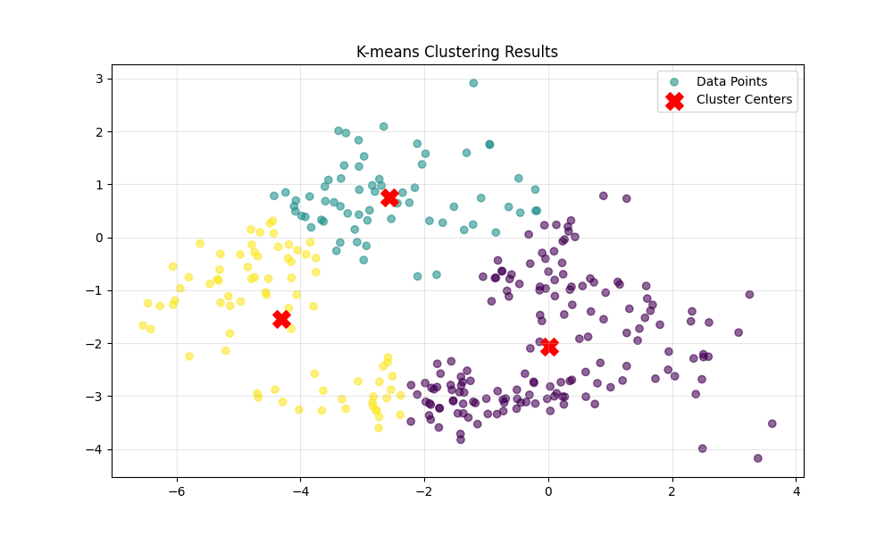 | 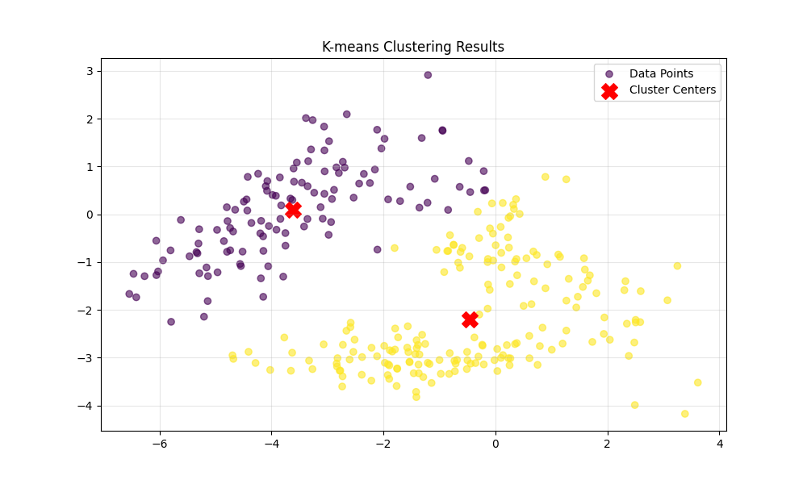 |
| :---: | :---: |
| **Centroids same group** | **One centroid far** |

3. How does it behave when the number of clusters is more or less than the "ideal"? 

As for the EM algorithm, changing the number of clusters forces the model to either underfit or overfit. Setting K=2 forces the algorithm to merge two groups into one, while setting K>3 causes it to split a single cluster into sub-clusters, even though there is no gap in their data points to justify different centers. The two algorithms seem to have the same results.

| 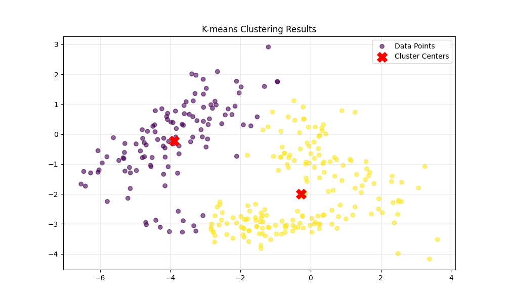 |  |
| :---: | :---: |
| **K=2** | **K=4** |